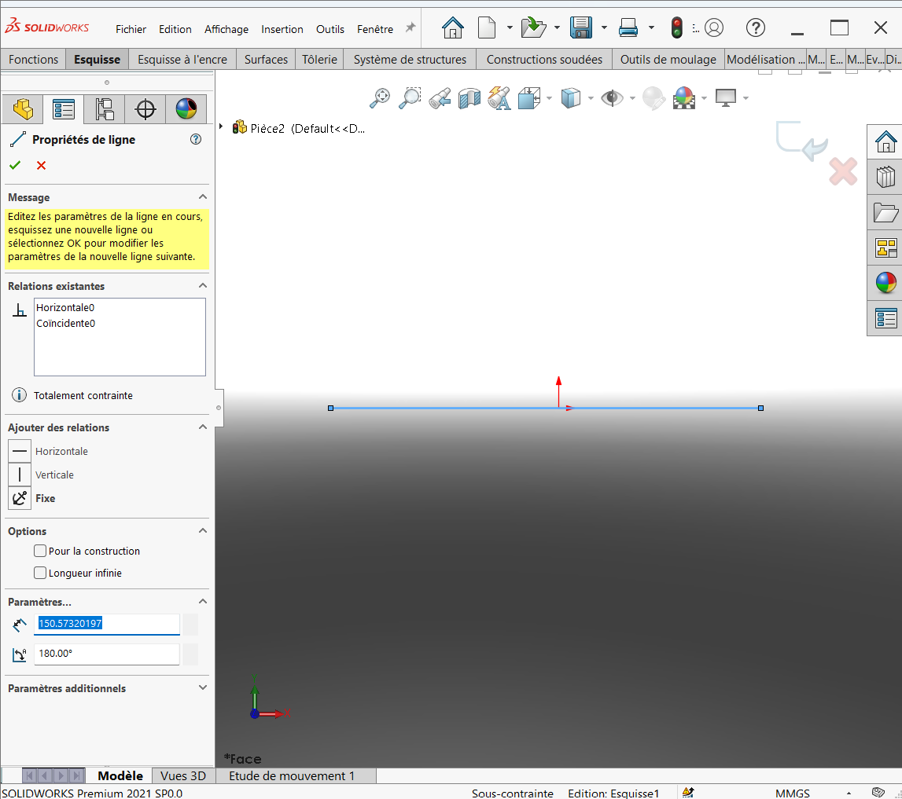
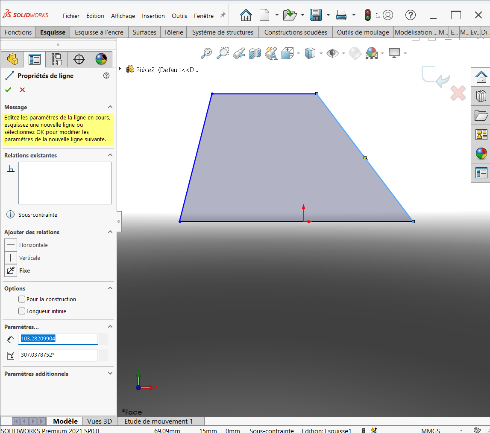
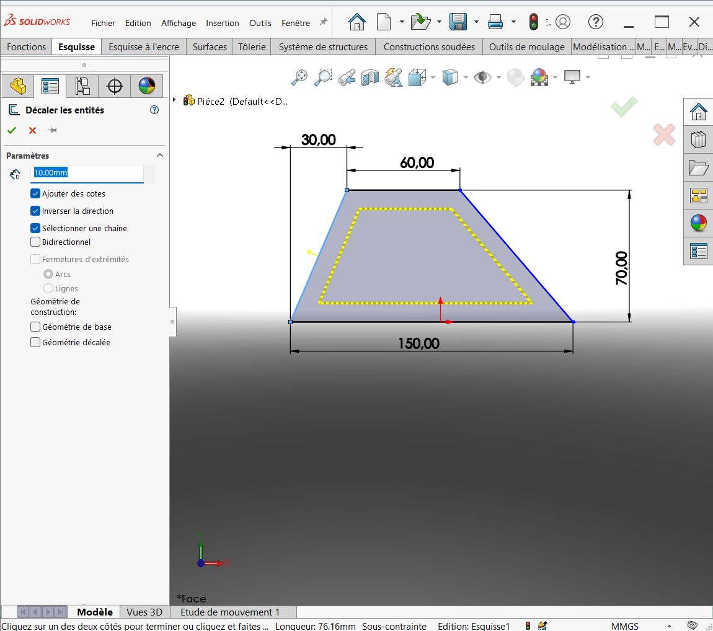
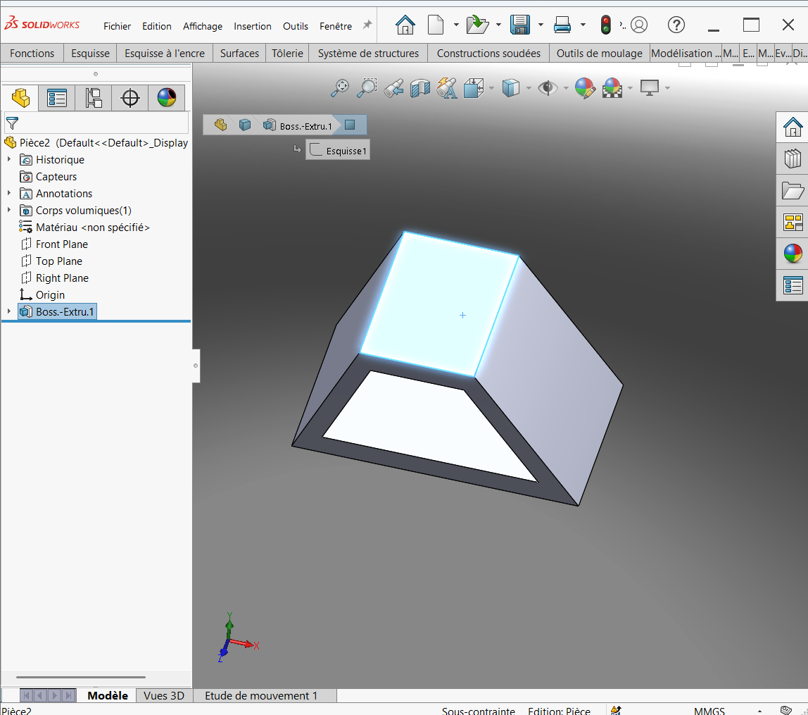
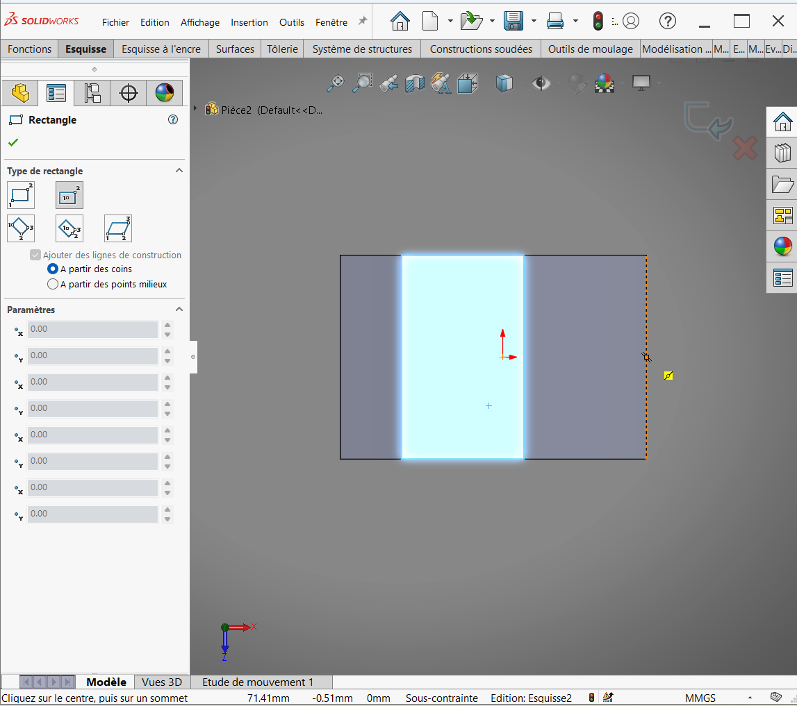
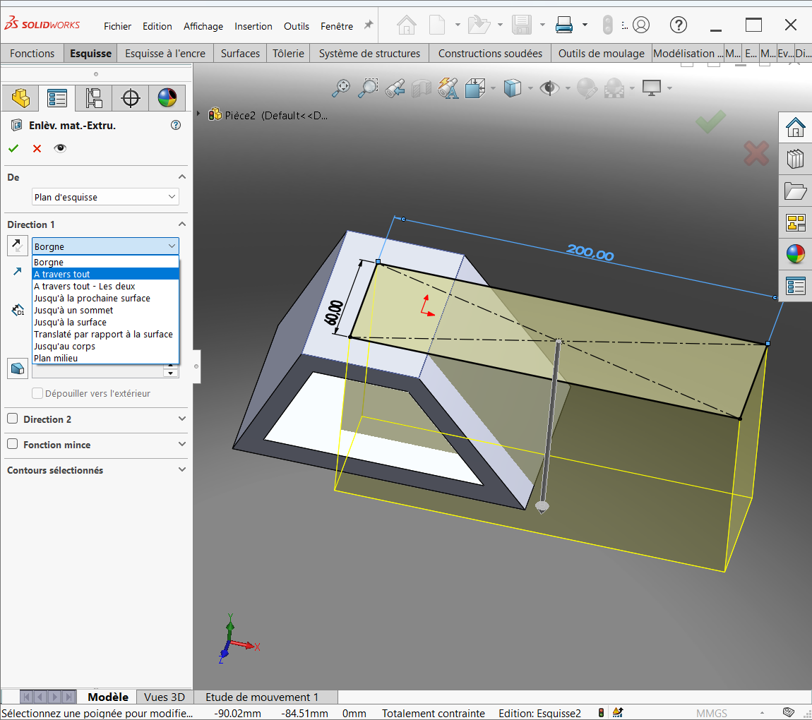
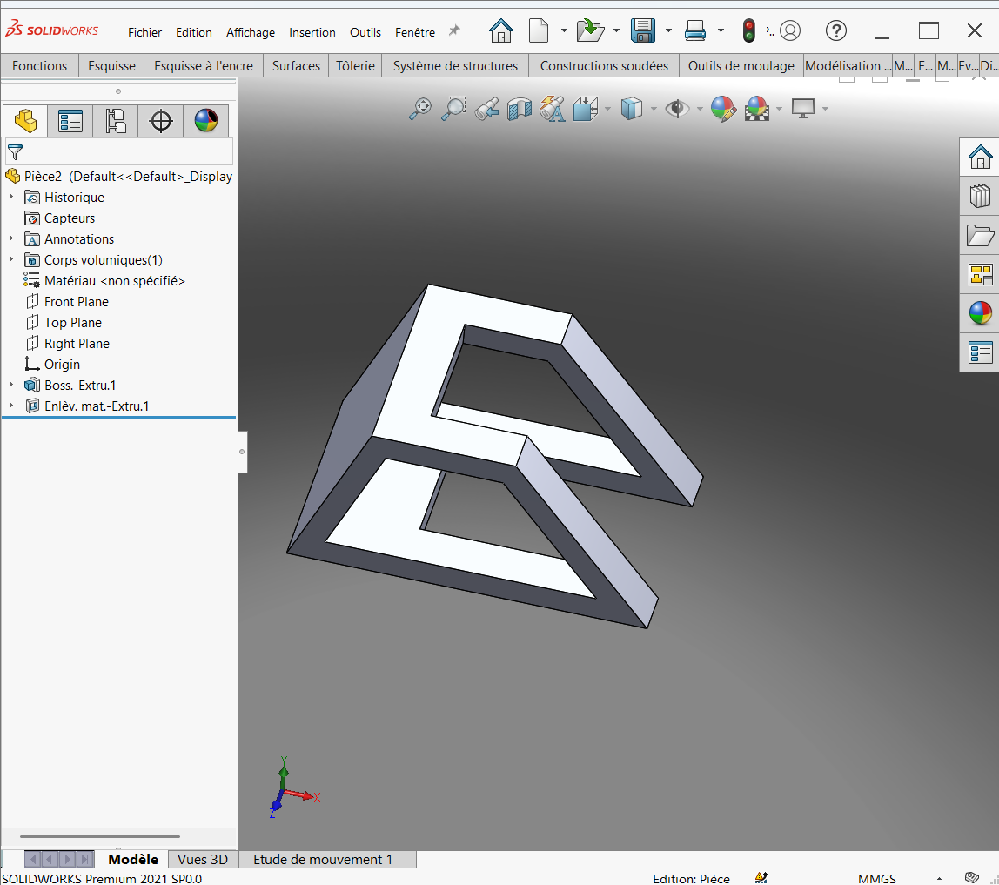
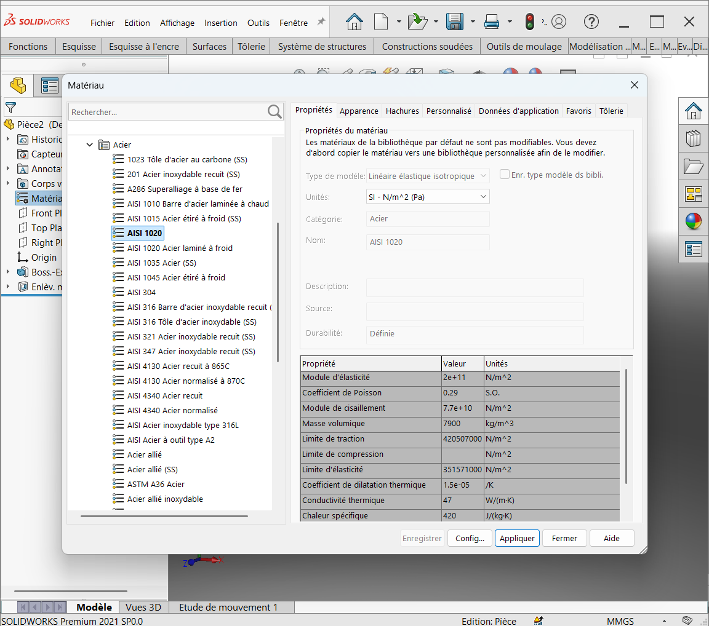

## III. TROISIÈME PIÈCE

### 1. Présentation générale de la pièce 3

- **Nom de la pièce** : Pièce 3  
- **Date de création** : 07/06/2025  
- **Échelle** : 1/1  

---

### 2. Caractéristiques techniques de la pièce 3

- **Système d’unité** : MMGS (millimètre, gramme, seconde)  
- **Décimale** : 2 (toutes les dimensions doivent être exprimées avec deux chiffres après la virgule)  
- **Tolérance** : ± 5 %  
- **Matériau** : Acier AISI 1020  
- **Densité** : 0,0079 g/mm³  
- **Remarque** : Tous les trous sont débouchants sauf indication contraire  

---

### 3. Représentation graphique de la pièce 3

Selon notre analyse, la pièce présente les vues suivantes :

- **Vue de face**  
- **Vue de droite**  
- **Vue de dessous**  
- **Vue isométrique**

---

### 4. Processus de réalisation de la pièce 3

L'objectif est de réaliser cette pièce **rapidement** avec un **nombre minimal de fonctions** hors esquisses. Après analyse, nous avons identifié que **deux fonctions principales** suffisent :

- **Extrusion** de la base rose sur une hauteur de **100 mm**  
- **Enlèvement de matière** pour créer un évidement de **60 mm x 10 mm**

---

#### 1ère Étape : Réalisation de l'extrusion

**Préparation de l'esquisse** :

- Plan utilisé : **Plan de face**  
- Tracer le contour de l’esquisse et la **coter entièrement**  
- Appliquer un **décalage** de l’esquisse de **10 mm** vers l’extérieur

  

  

  

  

**Extrusion** :

- Aller dans la fonction **Extrusion**  
- Appliquer l'extrusion à **100 mm**  
- Choisir **Plan milieu** comme direction  
- Valider l'opération

  

  

  

#### 2ème Étape : Enlèvement de matière

**Préparation de l'esquisse** :

- Sélectionner la **face bleue** comme plan d'esquisse  
- Dessiner l’évidement à enlever (dimensions : **60 mm x 10 mm**)  

**Application de la fonction** :

- Aller dans la fonction **Enlèvement de matière**  
- Sélectionner l’esquisse précédente  
- Valider l’opération

  

  

  

  

  

#### 3ème Étape : Configuration du matériau et évaluation de la masse

**Définition du matériau** :

- Clic droit sur la pièce > **Éditer le matériau**  
- Sélectionner **Acier AISI 1020**

  

**Évaluation de la masse** :

- Aller dans l’onglet **Évaluer** > **Propriétés de masse**  
- **Résultat** : ****

