## IV. QUATRIÈME PIÈCE

### 1. Présentation générale de la pièce 4

- **Nom de la pièce** : Pièce 4  
- **Date de création** : 07/06/2025  
- **Échelle** : 1/1  

---

### 2. Caractéristiques techniques

- **Système d’unité** : MMGS (millimètre, gramme, seconde)  
- **Décimale** : 2 (toutes les dimensions doivent être exprimées avec deux chiffres après la virgule)  
- **Tolérance** : ± 5 %  
- **Matériau** : Aluminium Alliage 1060  
- **Densité** : 0,0027 g/mm³  
- **Remarque** : Tous les trous sont débouchants sauf indication contraire  

---

### 3. Représentation graphique de la pièce 4

La pièce présente les vues suivantes :

- **Vue de face**  
- **Vue de gauche**  
- **Vue de dessous**  
- **Vue isométrique**

---

### 4. Processus de réalisation de la pièce 4

L'objectif est de réaliser cette pièce en un **temps record** en utilisant un **nombre minimal de fonctions**. Nous avons utilisé **quatre fonctions principales** :

- **Bossage** de la base rouge (50 mm)  
- **Bossage** de la zone grise (10 mm)  
- **Bossage** du cylindre jaune (5 mm)  
- **Congé** de rayon 2 mm  
- **Enlèvement de matière** de la zone verte  

---

#### Étape 1 : Configuration des paramètres initiaux

**Système d’unité :**

- En bas à droite de l'interface SolidWorks, cliquer sur l’indicateur (ex. : IPS, MMGS, etc.)
- Sélectionner **MMGS**

**Matériau :**

- Clic droit sur la pièce dans l’arbre de création  
- Sélectionner **Matériau > Éditer le matériau**  
- Choisir **Alliage d'aluminium > Alliage 1060**

---

#### Étape 2 : Première extrusion (base rouge)

- Sélectionner le **plan de face**  
- Créer une **esquisse** avec la **fonction ligne**  
- Appliquer la **cotation intelligente**  
- Aller dans **Fonctions > Base extrudée**  
- Définir la **profondeur à 50 mm**

---

  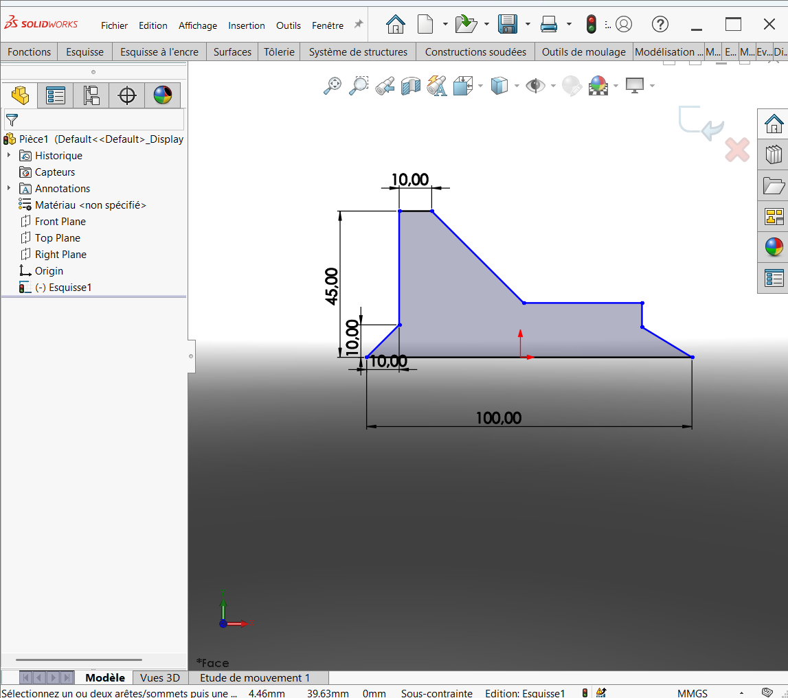

  

  

#### Étape 3 : Deuxième extrusion (zone grise)

- Sélectionner la **face supérieure** comme plan d’esquisse  
- Tracer la **forme à extruder**  
- Aller dans **Fonctions > Base extrudée**  
- Définir la **profondeur à 10 mm**

  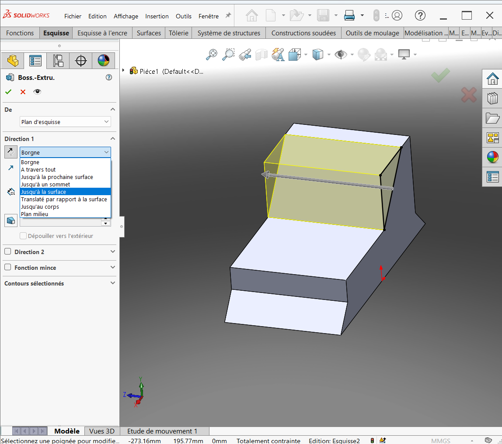

  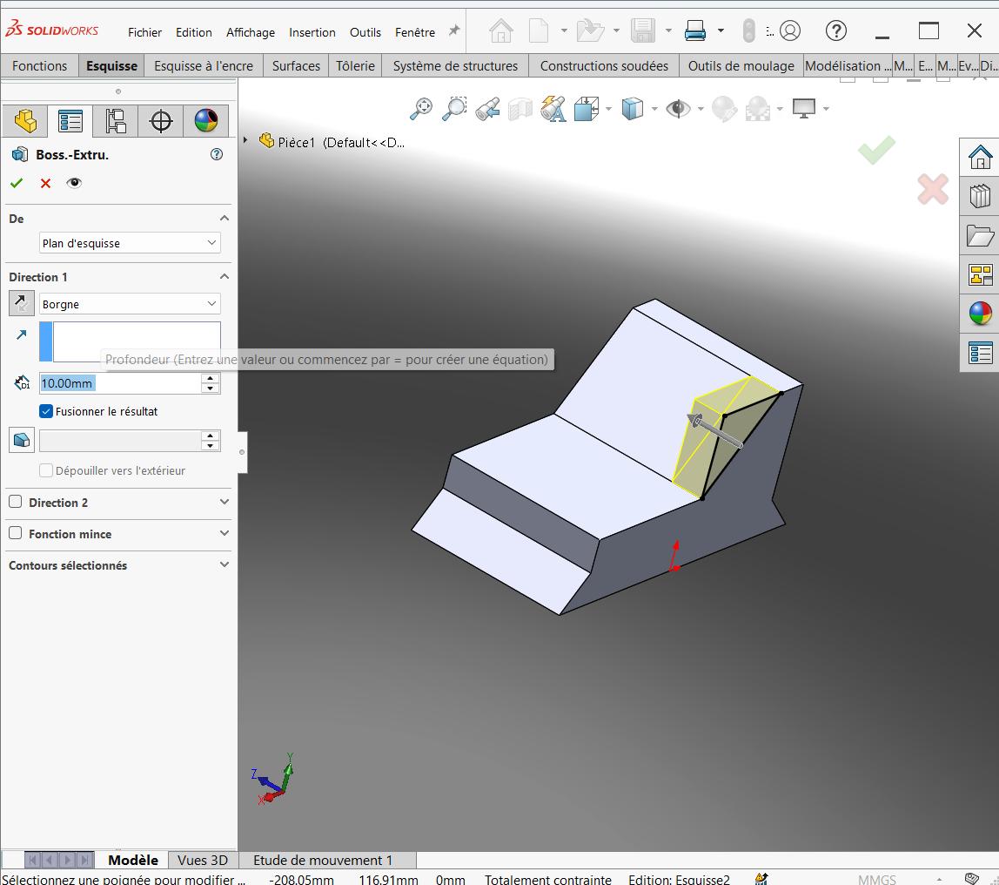

  

#### Étape 4 : Troisième extrusion (cylindre jaune)

- Sélectionner la **face supérieure** comme plan d’esquisse  
- Utiliser l’outil **Cercle** pour dessiner un cercle centré à l’origine  
- Appliquer la **cotation intelligente**  
- Aller dans **Fonctions > Base extrudée**  
- Définir la **hauteur à 5 mm**

  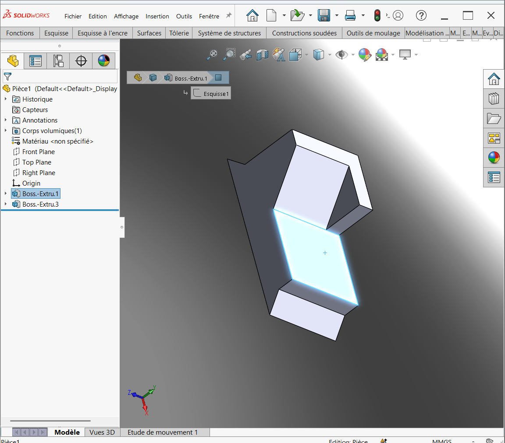

  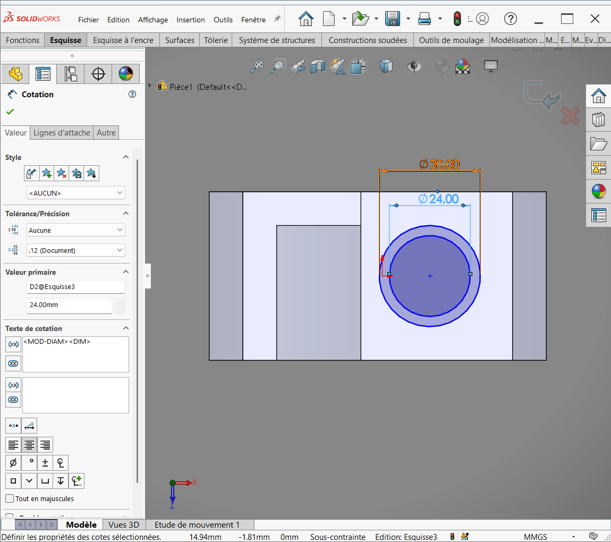

  

p align="center">
  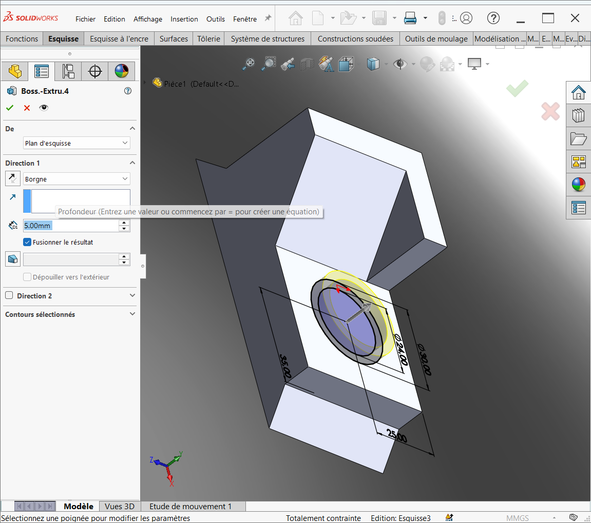

p align="center">
  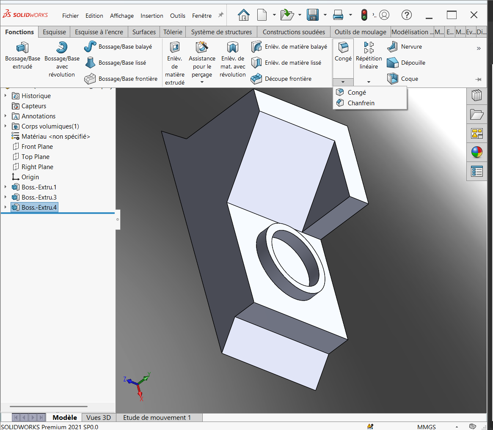

#### Étape 5 : Congé

- Aller dans **Fonctions > Congé**  
- Sélectionner **l’arête de base du cylindre**  
- Définir le **rayon à 2 mm**  
- Appliquer

p align="center">
  

p align="center">
  

#### Étape 6 : Enlèvement de matière

**Création de l’esquisse :**

- Sélectionner une **face plane** (zone bleue)  
- Utiliser l’outil **Rectangle > Rectangle par coin**  
- Appliquer la **cotation intelligente**  
- Si une erreur se produit à l’ajout de la cote 30 mm :  
  - Accéder à l’**esquisse via l’arbre de création**  
  - Clic droit > **Modifier l’esquisse**  
  - Corriger les contraintes en utilisant **colinéarité**

**Enlèvement de matière :**

- Aller dans **Fonctions > Enlèvement de matière par extrusion**  
- Définir la **profondeur jusqu’à la surface du congé**

p align="center">
  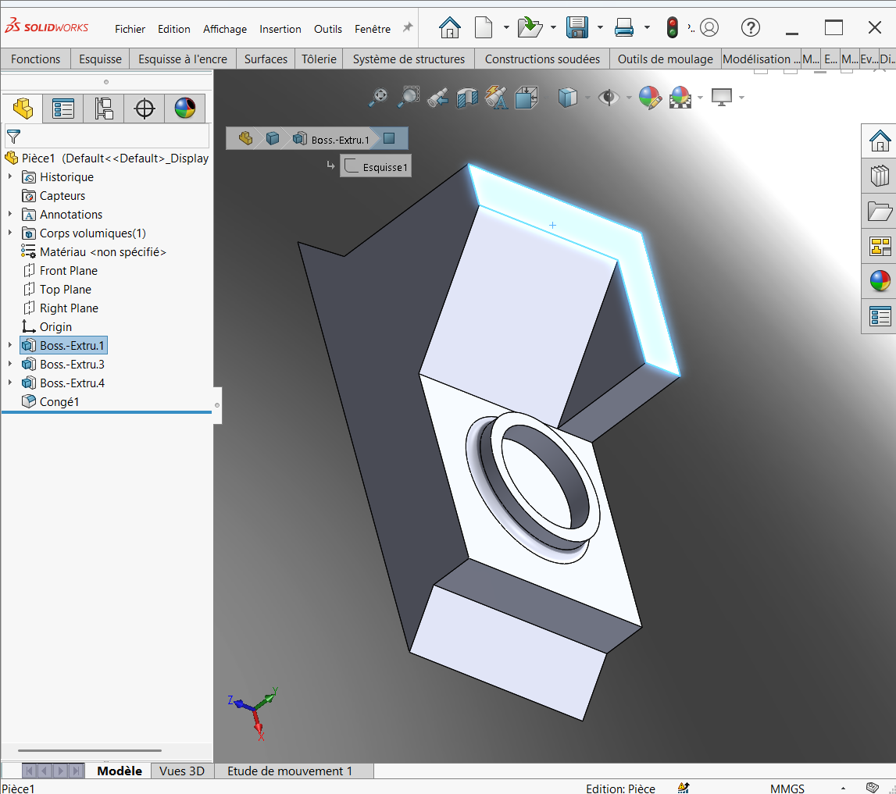

p align="center">
  

p align="center">
  

p align="center">
  

p align="center">
  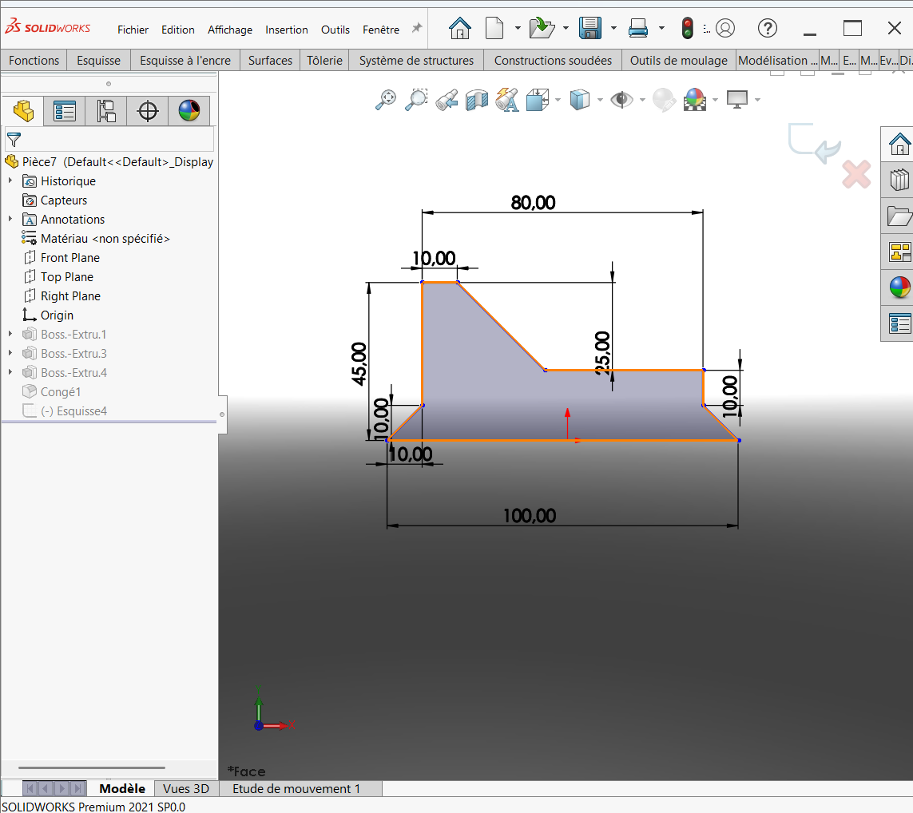

p align="center">
  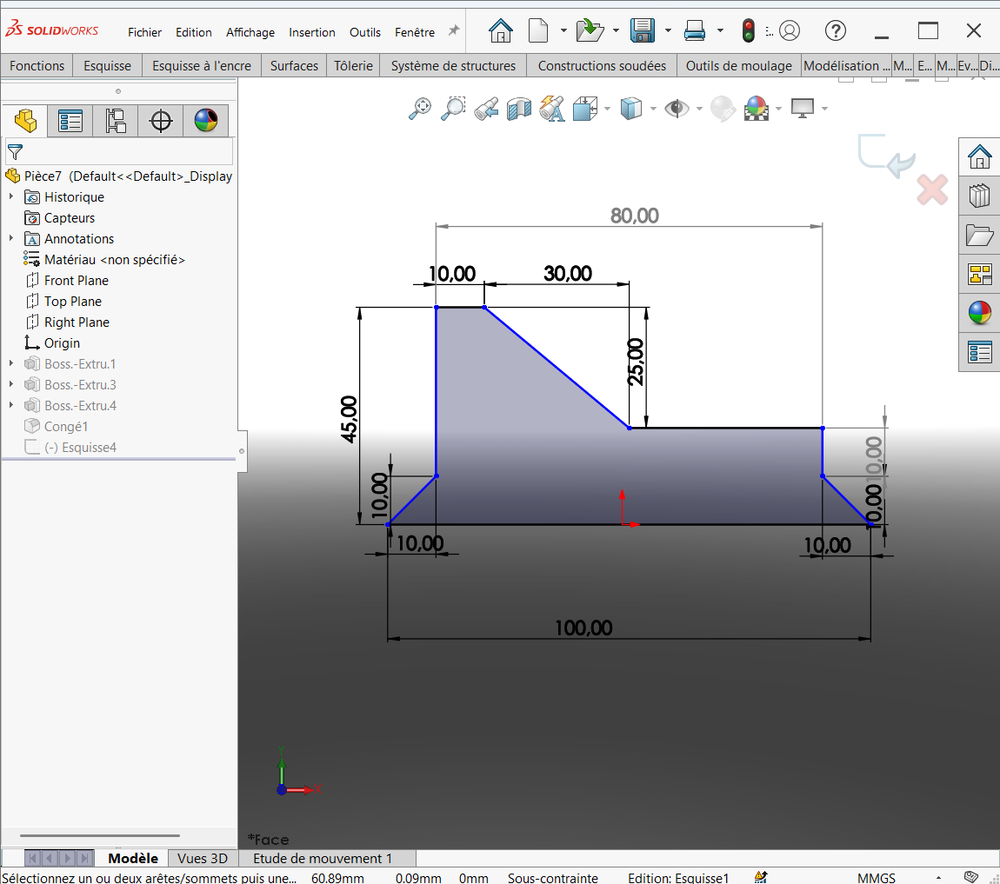

p align="center">
  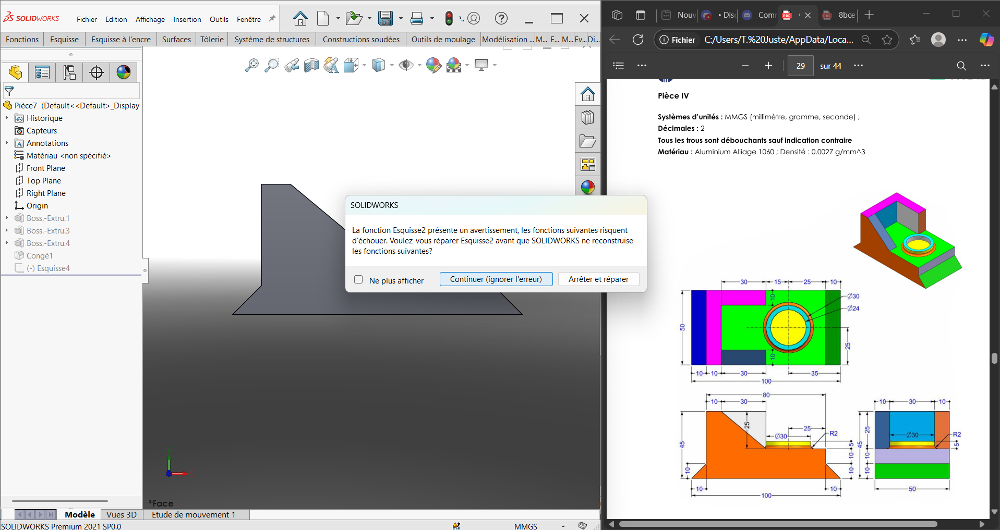

p align="center">
  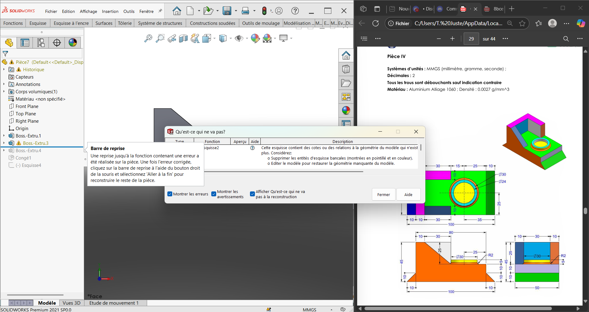

p align="center">
  

p align="center">
  

p align="center">
  

p align="center">
  

#### Étape 7 : Évaluation de la masse

- Aller dans l’onglet **Évaluer**  
- Cliquer sur **Propriétés de masse**  
- La masse est calculée automatiquement par SolidWorks
- **Résultat** : **297.29g**

